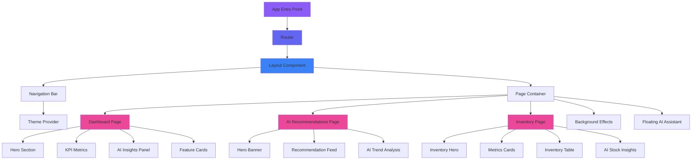
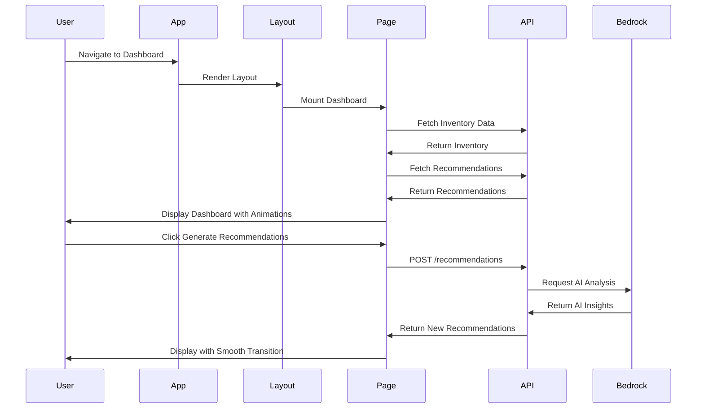

# Design Document: Premium AI SaaS Dashboard Redesign

## Overview

This design document outlines the comprehensive redesign of RetailMind AI's dashboard interface, transforming it from a standard React application into a premium AI SaaS platform with modern glassmorphism aesthetics, gradient themes, and smooth animations. The redesign focuses on creating an enterprise-grade user experience inspired by industry leaders like Linear, Stripe, Notion AI, and Vercel, while maintaining the existing React + Vite + TypeScript architecture and AWS backend integration (Lambda, DynamoDB, API Gateway, Bedrock).

The redesign encompasses three main pages (Dashboard, AI Recommendations, Inventory Management) with a unified design system featuring purple-blue-pink gradients, glassmorphism cards with backdrop blur, soft shadows, rounded corners (16px-24px), and smooth hover animations. Key additions include a floating AI assistant, animated background with grid patterns and glowing gradients, enhanced navigation bar, and comprehensive use of Framer Motion for animations.

## Architecture



## Main Application Flow




## Components and Interfaces

### Core Layout Components

#### NavigationBar Component

**Purpose**: Top navigation bar with logo, menu items, notifications, user avatar, and theme toggle

**Interface**:
```typescript
interface NavigationBarProps {
  currentPath: string
  onNavigate: (path: string) => void
  theme: 'light' | 'dark'
  onThemeToggle: () => void
  notifications: Notification[]
  user: UserProfile
}

interface Notification {
  id: string
  type: 'info' | 'warning' | 'success' | 'error'
  message: string
  timestamp: Date
  read: boolean
}

interface UserProfile {
  name: string
  email: string
  avatar: string
  role: string
}
```

**Responsibilities**:
- Render logo and navigation menu items
- Handle route navigation with smooth transitions
- Display notification badge with count
- Manage theme toggle (light/dark mode)
- Show user avatar with dropdown menu
- Apply glassmorphism effect with backdrop blur

#### BackgroundEffects Component

**Purpose**: Animated background with subtle grid pattern and glowing gradient effects

**Interface**:
```typescript
interface BackgroundEffectsProps {
  variant: 'grid' | 'particles' | 'gradient'
  intensity: 'low' | 'medium' | 'high'
  animated: boolean
}
```

**Responsibilities**:
- Render subtle grid background pattern
- Animate floating gradient orbs
- Create AI particle effects
- Ensure performance optimization with CSS transforms
- Support theme-aware color schemes

#### FloatingAIAssistant Component

**Purpose**: Bottom-right chat bubble for AI assistance with example prompts

**Interface**:
```typescript
interface FloatingAIAssistantProps {
  isOpen: boolean
  onToggle: () => void
  onPromptSelect: (prompt: string) => void
  examplePrompts: string[]
}
```

**Responsibilities**:
- Display chat bubble with AI icon
- Show/hide assistant panel with animation
- Render example prompt suggestions
- Handle prompt selection and submission
- Integrate with AI backend for responses


### Dashboard Page Components

#### HeroSection Component

**Purpose**: Large gradient banner with glass effect, title, subtitle, and action buttons

**Interface**:
```typescript
interface HeroSectionProps {
  title: string
  subtitle: string
  primaryAction: ActionButton
  secondaryAction?: ActionButton
  showSparkleAnimation: boolean
}

interface ActionButton {
  label: string
  icon: React.ReactNode
  onClick: () => void
  variant: 'primary' | 'secondary' | 'danger'
  loading?: boolean
  disabled?: boolean
}
```

**Responsibilities**:
- Render gradient background with animated orbs
- Display title with AI sparkle animation
- Show action buttons with hover effects
- Apply glassmorphism styling
- Handle button click events

#### KPIMetricsGrid Component

**Purpose**: Display 4 premium metric cards with animated icons and trend indicators

**Interface**:
```typescript
interface KPIMetricsGridProps {
  metrics: KPIMetric[]
}

interface KPIMetric {
  id: string
  title: string
  value: string | number
  icon: React.ReactNode
  color: 'blue' | 'red' | 'green' | 'purple' | 'orange'
  trend?: TrendIndicator
  sparklineData?: number[]
}

interface TrendIndicator {
  value: number
  direction: 'up' | 'down'
  label: string
}
```

**Responsibilities**:
- Render 4 metric cards in responsive grid
- Animate icons inside gradient circles
- Display trend indicators with arrows
- Show micro sparkline charts
- Apply hover lift animation
- Support real-time data updates

#### AIInsightsPanel Component

**Purpose**: Display AI recommendations with empty state and filled state views

**Interface**:
```typescript
interface AIInsightsPanelProps {
  recommendations: AIRecommendation[]
  onGenerateNew: () => void
  onRecommendationClick: (id: string) => void
  loading: boolean
}

interface AIRecommendation {
  recommendationId: string
  title: string
  description: string
  productName: string
  recommendedAction: string
  confidence: number
  impactPrediction: string
  priority: 'critical' | 'high' | 'medium' | 'low'
  status: 'pending' | 'accepted' | 'dismissed'
}
```

**Responsibilities**:
- Show empty state with animated AI icon and CTA
- Display recommendation cards with confidence scores
- Render impact predictions and quick actions
- Apply staggered animation on load
- Handle recommendation interactions


#### RetailFeaturesGrid Component

**Purpose**: 4 interactive feature cards with background images and hover zoom

**Interface**:
```typescript
interface RetailFeaturesGridProps {
  features: RetailFeature[]
}

interface RetailFeature {
  id: string
  title: string
  description: string
  backgroundImage: string
  icon: React.ReactNode
  ctaLabel: string
  onExplore: () => void
}
```

**Responsibilities**:
- Render 4 feature cards in grid layout
- Display background images with overlay gradient
- Apply hover zoom animation
- Show feature descriptions and explore buttons
- Handle navigation to feature details

### AI Recommendations Page Components

#### RecommendationHeroBanner Component

**Purpose**: Purple/pink gradient banner with title and generate button

**Interface**:
```typescript
interface RecommendationHeroBannerProps {
  title: string
  subtitle: string
  onGenerateNew: () => void
  generating: boolean
}
```

**Responsibilities**:
- Render gradient background (purple to pink)
- Display title and subtitle
- Show generate button with loading state
- Apply glassmorphism effects
- Handle generate action

#### RecommendationFeed Component

**Purpose**: Display AI recommendation cards with detailed metrics and actions

**Interface**:
```typescript
interface RecommendationFeedProps {
  recommendations: DetailedRecommendation[]
  onAccept: (id: string) => void
  onDismiss: (id: string) => void
  processingId: string | null
}

interface DetailedRecommendation extends AIRecommendation {
  currentStock: number
  recommendedQuantity: number
  estimatedCost: number
  aiInsight: string
  problemDetected: string
  expectedBusinessImpact: string
}
```

**Responsibilities**:
- Render recommendation cards with full details
- Display metrics grid (stock, quantity, cost, confidence)
- Show AI insight section with brain icon
- Render priority badges with color coding
- Handle accept/dismiss actions with confirmation
- Apply staggered card animations


#### AITrendAnalysisPanel Component

**Purpose**: Side panel with charts showing demand forecast, inventory risk, and sales patterns

**Interface**:
```typescript
interface AITrendAnalysisPanelProps {
  demandForecast: ChartData
  inventoryRisk: ChartData
  salesPattern: ChartData
}

interface ChartData {
  labels: string[]
  datasets: Dataset[]
  type: 'line' | 'bar' | 'area'
}

interface Dataset {
  label: string
  data: number[]
  color: string
  gradient?: boolean
}
```

**Responsibilities**:
- Render three chart sections
- Display demand forecast line chart
- Show inventory risk gauge/bar chart
- Render weekly sales pattern area chart
- Apply gradient fills to charts
- Support responsive layout

### Inventory Page Components

#### InventoryHeroSection Component

**Purpose**: Hero section with title, subtitle, and action buttons

**Interface**:
```typescript
interface InventoryHeroSectionProps {
  title: string
  subtitle: string
  actions: InventoryAction[]
  totalItems: number
}

interface InventoryAction {
  label: string
  icon: React.ReactNode
  onClick: () => void
  variant: 'primary' | 'secondary' | 'danger'
  loading?: boolean
}
```

**Responsibilities**:
- Render emerald/teal gradient background
- Display title and subtitle
- Show action buttons (Add Product, Analytics, Clear)
- Apply glassmorphism effects
- Handle action button clicks

#### InventoryMetricsCards Component

**Purpose**: Display 4 metrics cards with icons, trends, and micro charts

**Interface**:
```typescript
interface InventoryMetricsCardsProps {
  metrics: InventoryMetric[]
}

interface InventoryMetric {
  id: string
  title: string
  value: string | number
  icon: React.ReactNode
  color: 'blue' | 'red' | 'green' | 'purple'
  trend?: TrendIndicator
  microChart?: number[]
  subtitle?: string
}
```

**Responsibilities**:
- Render 4 metric cards in grid
- Display icons in gradient circles
- Show trend indicators
- Render micro sparkline charts
- Apply hover animations


#### InventoryTable Component

**Purpose**: Modern glass card table with product data, status badges, and AI insights

**Interface**:
```typescript
interface InventoryTableProps {
  items: InventoryItem[]
  onRowClick: (id: string) => void
  sortBy: SortConfig
  onSort: (field: string) => void
}

interface InventoryItem {
  productId: string
  productName: string
  category: string
  currentStock: number
  reorderPoint: number
  status: 'critical' | 'low' | 'optimal' | 'overstock'
  price: number
  totalValue: number
  hasAIInsight: boolean
}

interface SortConfig {
  field: string
  direction: 'asc' | 'desc'
}
```

**Responsibilities**:
- Render table with glassmorphism card styling
- Display product rows with hover animation
- Show status badges with color coding (green/yellow/red)
- Render progress bars for stock levels
- Display AI insight icons for products with suggestions
- Support column sorting
- Apply staggered row animations

#### AIStockInsightsPanel Component

**Purpose**: Right panel showing AI-generated stock insights and alerts

**Interface**:
```typescript
interface AIStockInsightsPanelProps {
  insights: StockInsight[]
  onInsightClick: (id: string) => void
}

interface StockInsight {
  id: string
  type: 'warning' | 'info' | 'success'
  message: string
  productIds: string[]
  timestamp: Date
  priority: number
}
```

**Responsibilities**:
- Display insight cards with icons
- Show warning messages for low stock
- Render demand trend alerts
- Display restock recommendations
- Apply color coding by insight type
- Handle insight click navigation


## Data Models

### Theme Configuration

```typescript
interface ThemeConfig {
  mode: 'light' | 'dark'
  colors: ColorPalette
  gradients: GradientPalette
  effects: EffectSettings
}

interface ColorPalette {
  primary: string
  secondary: string
  accent: string
  background: string
  surface: string
  text: {
    primary: string
    secondary: string
    disabled: string
  }
  status: {
    success: string
    warning: string
    error: string
    info: string
  }
}

interface GradientPalette {
  primary: string // purple → blue
  secondary: string // blue → pink
  accent: string // pink → purple
  hero: string // multi-color gradient
}

interface EffectSettings {
  glassmorphism: {
    blur: string
    opacity: number
    border: string
  }
  shadows: {
    sm: string
    md: string
    lg: string
    xl: string
  }
  borderRadius: {
    sm: string
    md: string
    lg: string
    xl: string
  }
}
```

**Validation Rules**:
- Mode must be either 'light' or 'dark'
- All color values must be valid CSS color strings
- Opacity values must be between 0 and 1
- Border radius values must be valid CSS length units

### Animation Configuration

```typescript
interface AnimationConfig {
  duration: {
    fast: number
    normal: number
    slow: number
  }
  easing: {
    easeIn: string
    easeOut: string
    easeInOut: string
    spring: SpringConfig
  }
  variants: AnimationVariants
}

interface SpringConfig {
  type: 'spring'
  stiffness: number
  damping: number
  mass: number
}

interface AnimationVariants {
  fadeIn: MotionVariant
  slideUp: MotionVariant
  scaleIn: MotionVariant
  stagger: StaggerConfig
}

interface MotionVariant {
  initial: Record<string, any>
  animate: Record<string, any>
  exit?: Record<string, any>
}

interface StaggerConfig {
  delayChildren: number
  staggerChildren: number
}
```

**Validation Rules**:
- Duration values must be positive numbers (milliseconds)
- Easing strings must be valid CSS timing functions
- Spring stiffness must be between 0 and 1000
- Spring damping must be between 0 and 100


### Dashboard State

```typescript
interface DashboardState {
  inventory: InventoryData
  recommendations: RecommendationsData
  metrics: MetricsData
  loading: LoadingState
  error: ErrorState | null
}

interface InventoryData {
  items: InventoryItem[]
  totalCount: number
  lowStockCount: number
  optimalCount: number
  totalValue: number
  lastUpdated: Date
}

interface RecommendationsData {
  recommendations: AIRecommendation[]
  totalCount: number
  pendingCount: number
  acceptedCount: number
  lastGenerated: Date | null
}

interface MetricsData {
  totalProducts: number
  lowStockAlerts: number
  aiRecommendations: number
  automationSuccessRate: number
  trends: {
    products: TrendIndicator
    alerts: TrendIndicator
    recommendations: TrendIndicator
    automation: TrendIndicator
  }
}

interface LoadingState {
  inventory: boolean
  recommendations: boolean
  metrics: boolean
  generating: boolean
}

interface ErrorState {
  code: string
  message: string
  details?: any
}
```

**Validation Rules**:
- All count values must be non-negative integers
- Total value must be non-negative number
- Success rate must be between 0 and 100
- Dates must be valid Date objects
- Loading states must be boolean values


## Algorithmic Pseudocode

### Main Dashboard Rendering Algorithm

```typescript
function renderDashboard(): JSX.Element {
  // Preconditions:
  // - User is authenticated
  // - API endpoints are accessible
  // - Theme configuration is loaded
  
  const [state, setState] = useState<DashboardState>(initialState)
  const [theme, setTheme] = useState<'light' | 'dark'>('light')
  
  // Step 1: Initialize data fetching on mount
  useEffect(() => {
    async function fetchDashboardData() {
      setState(prev => ({ ...prev, loading: { ...prev.loading, inventory: true, recommendations: true } }))
      
      try {
        // Parallel data fetching for performance
        const [inventoryResponse, recommendationsResponse] = await Promise.all([
          axios.get(API_ENDPOINTS.inventory),
          axios.get(API_ENDPOINTS.recommendations)
        ])
        
        // Calculate metrics from fetched data
        const metrics = calculateMetrics(inventoryResponse.data, recommendationsResponse.data)
        
        setState({
          inventory: inventoryResponse.data,
          recommendations: recommendationsResponse.data,
          metrics,
          loading: { inventory: false, recommendations: false, metrics: false, generating: false },
          error: null
        })
      } catch (error) {
        setState(prev => ({
          ...prev,
          loading: { inventory: false, recommendations: false, metrics: false, generating: false },
          error: { code: 'FETCH_ERROR', message: error.message }
        }))
      }
    }
    
    fetchDashboardData()
  }, [])
  
  // Step 2: Render with animations
  return (
    <motion.div
      initial={{ opacity: 0 }}
      animate={{ opacity: 1 }}
      transition={{ duration: 0.5 }}
    >
      <BackgroundEffects variant="grid" intensity="medium" animated={true} />
      
      <HeroSection
        title="Welcome to RetailMind AI"
        subtitle="AI-powered retail intelligence powered by Amazon Bedrock"
        primaryAction={{
          label: "Seed Data",
          icon: <Database />,
          onClick: handleSeedData,
          variant: "primary"
        }}
        secondaryAction={{
          label: "Clear Data",
          icon: <Trash2 />,
          onClick: handleClearData,
          variant: "danger"
        }}
        showSparkleAnimation={true}
      />
      
      <KPIMetricsGrid metrics={state.metrics} />
      
      <AIInsightsPanel
        recommendations={state.recommendations.recommendations}
        onGenerateNew={handleGenerateRecommendations}
        onRecommendationClick={handleRecommendationClick}
        loading={state.loading.generating}
      />
      
      <RetailFeaturesGrid features={retailFeatures} />
      
      <FloatingAIAssistant
        isOpen={assistantOpen}
        onToggle={toggleAssistant}
        onPromptSelect={handlePromptSelect}
        examplePrompts={examplePrompts}
      />
    </motion.div>
  )
  
  // Postconditions:
  // - Dashboard is rendered with all components
  // - Data is fetched and displayed
  // - Animations are applied
  // - Error states are handled
}
```

**Preconditions**:
- User authentication is verified
- API endpoints are configured and accessible
- Theme configuration is loaded from localStorage or defaults
- React Query client is initialized

**Postconditions**:
- Dashboard renders successfully with all components
- Data is fetched from API and displayed
- Loading states are managed correctly
- Animations are applied to all interactive elements
- Error states are handled and displayed to user

**Loop Invariants**: N/A (no explicit loops in main render)


### Recommendation Generation Algorithm

```typescript
async function generateRecommendations(): Promise<AIRecommendation[]> {
  // Preconditions:
  // - Inventory data exists in database
  // - AWS Bedrock API is accessible
  // - User has permission to generate recommendations
  
  // Step 1: Set loading state
  setState(prev => ({ ...prev, loading: { ...prev.loading, generating: true } }))
  
  try {
    // Step 2: Fetch current inventory data
    const inventoryResponse = await axios.get(API_ENDPOINTS.inventory)
    const inventoryItems = inventoryResponse.data.items
    
    // Step 3: Call AI recommendation endpoint
    const recommendationResponse = await axios.post(API_ENDPOINTS.recommendations, {
      inventoryData: inventoryItems,
      analysisType: 'comprehensive'
    })
    
    // Step 4: Process and validate recommendations
    const recommendations = recommendationResponse.data.recommendations
    const validatedRecommendations = recommendations.filter(rec => 
      rec.confidence >= 50 && 
      rec.recommendedQuantity > 0 &&
      rec.estimatedCost > 0
    )
    
    // Step 5: Update state with new recommendations
    setState(prev => ({
      ...prev,
      recommendations: {
        ...prev.recommendations,
        recommendations: validatedRecommendations,
        totalCount: validatedRecommendations.length,
        pendingCount: validatedRecommendations.filter(r => r.status === 'pending').length,
        lastGenerated: new Date()
      },
      loading: { ...prev.loading, generating: false }
    }))
    
    // Step 6: Show success notification
    showNotification({
      type: 'success',
      message: `Generated ${validatedRecommendations.length} AI recommendations`,
      duration: 3000
    })
    
    return validatedRecommendations
    
  } catch (error) {
    // Step 7: Handle errors
    setState(prev => ({
      ...prev,
      loading: { ...prev.loading, generating: false },
      error: { code: 'GENERATION_ERROR', message: error.message }
    }))
    
    showNotification({
      type: 'error',
      message: 'Failed to generate recommendations',
      duration: 5000
    })
    
    throw error
  }
  
  // Postconditions:
  // - Recommendations are generated and stored
  // - State is updated with new data
  // - User is notified of success/failure
  // - Loading state is cleared
}
```

**Preconditions**:
- Inventory data exists in DynamoDB
- AWS Bedrock API is accessible and configured
- User has valid authentication token
- API endpoints are properly configured

**Postconditions**:
- AI recommendations are generated via Bedrock
- Recommendations are validated (confidence >= 50%, quantity > 0, cost > 0)
- State is updated with new recommendations
- User receives success/error notification
- Loading state is properly cleared

**Loop Invariants**:
- During recommendation filtering: All previously validated recommendations meet criteria
- Validation state remains consistent throughout iteration


### Animation Orchestration Algorithm

```typescript
function applyStaggeredAnimation(
  elements: HTMLElement[],
  variant: AnimationVariant,
  config: StaggerConfig
): void {
  // Preconditions:
  // - elements array is not empty
  // - variant contains valid animation properties
  // - config has valid delay and stagger values
  
  const { delayChildren, staggerChildren } = config
  
  // Step 1: Iterate through elements and apply animations
  for (let i = 0; i < elements.length; i++) {
    // Loop Invariant: All previous elements have animations applied
    
    const element = elements[i]
    const delay = delayChildren + (i * staggerChildren)
    
    // Step 2: Apply Framer Motion animation
    const controls = animate(element, variant.animate, {
      delay,
      duration: 0.5,
      ease: 'easeOut'
    })
    
    // Step 3: Store animation control for cleanup
    animationControls.push(controls)
  }
  
  // Postconditions:
  // - All elements have animations applied
  // - Animations are staggered with correct delays
  // - Animation controls are stored for cleanup
}

function applyGlassmorphismEffect(element: HTMLElement, theme: ThemeConfig): void {
  // Preconditions:
  // - element is a valid DOM element
  // - theme contains glassmorphism settings
  
  const { blur, opacity, border } = theme.effects.glassmorphism
  
  // Apply CSS properties
  element.style.backdropFilter = `blur(${blur})`
  element.style.backgroundColor = `rgba(255, 255, 255, ${opacity})`
  element.style.border = border
  element.style.boxShadow = theme.effects.shadows.lg
  
  // Postconditions:
  // - Element has glassmorphism effect applied
  // - All CSS properties are set correctly
}

function animateGradientOrb(
  orb: HTMLElement,
  path: { x: number[], y: number[] },
  duration: number
): void {
  // Preconditions:
  // - orb is a valid DOM element
  // - path contains valid coordinate arrays
  // - duration is positive number
  
  // Create infinite loop animation
  const animation = animate(orb, {
    x: path.x,
    y: path.y,
    scale: [1, 1.2, 1],
    opacity: [0.3, 0.5, 0.3]
  }, {
    duration,
    repeat: Infinity,
    ease: 'easeInOut'
  })
  
  // Store for cleanup
  backgroundAnimations.push(animation)
  
  // Postconditions:
  // - Orb animates along specified path
  // - Animation loops infinitely
  // - Animation control is stored
}
```

**Preconditions**:
- DOM elements are mounted and accessible
- Animation configuration is valid
- Framer Motion is initialized
- Theme configuration is loaded

**Postconditions**:
- Animations are applied to all target elements
- Stagger delays are calculated correctly
- Glassmorphism effects are rendered
- Background animations loop infinitely
- All animation controls are stored for cleanup

**Loop Invariants**:
- For staggered animations: All previously processed elements have animations applied with correct delays
- Animation state remains consistent throughout iteration
- No memory leaks from animation controls


### Theme Toggle Algorithm

```typescript
function toggleTheme(currentTheme: 'light' | 'dark'): void {
  // Preconditions:
  // - currentTheme is either 'light' or 'dark'
  // - Theme configuration is loaded
  
  // Step 1: Determine new theme
  const newTheme = currentTheme === 'light' ? 'dark' : 'light'
  
  // Step 2: Update theme state
  setTheme(newTheme)
  
  // Step 3: Apply theme to document root
  document.documentElement.setAttribute('data-theme', newTheme)
  
  // Step 4: Update CSS variables
  const themeConfig = getThemeConfig(newTheme)
  Object.entries(themeConfig.colors).forEach(([key, value]) => {
    document.documentElement.style.setProperty(`--color-${key}`, value)
  })
  
  // Step 5: Persist to localStorage
  localStorage.setItem('theme', newTheme)
  
  // Step 6: Animate theme transition
  document.documentElement.classList.add('theme-transitioning')
  setTimeout(() => {
    document.documentElement.classList.remove('theme-transitioning')
  }, 300)
  
  // Postconditions:
  // - Theme is toggled to opposite value
  // - CSS variables are updated
  // - Theme is persisted to localStorage
  // - Smooth transition animation is applied
}
```

**Preconditions**:
- Current theme is valid ('light' or 'dark')
- Theme configuration object exists
- localStorage is accessible
- Document root element exists

**Postconditions**:
- Theme is toggled to opposite value
- All CSS variables are updated with new theme colors
- Theme preference is saved to localStorage
- Smooth transition animation is applied (300ms)
- All components re-render with new theme

**Loop Invariants**:
- During CSS variable update: All previously set variables remain valid
- Theme state remains consistent throughout update process


## Key Functions with Formal Specifications

### Function 1: calculateMetrics()

```typescript
function calculateMetrics(
  inventory: InventoryData,
  recommendations: RecommendationsData
): MetricsData
```

**Preconditions**:
- `inventory` is non-null and contains valid items array
- `recommendations` is non-null and contains valid recommendations array
- All inventory items have valid numeric values for stock and price
- All recommendations have valid status values

**Postconditions**:
- Returns valid MetricsData object
- All count values are non-negative integers
- Success rate is between 0 and 100
- Trend calculations are accurate based on historical data
- No side effects on input parameters

**Loop Invariants**: 
- During inventory iteration: All counted items are valid
- During recommendation filtering: Status values remain consistent

### Function 2: validateRecommendation()

```typescript
function validateRecommendation(recommendation: AIRecommendation): boolean
```

**Preconditions**:
- `recommendation` is defined (not null/undefined)
- `recommendation` has all required fields

**Postconditions**:
- Returns boolean value
- `true` if and only if recommendation meets all validation criteria:
  - confidence >= 50
  - recommendedQuantity > 0
  - estimatedCost > 0
  - status is valid enum value
- No mutations to recommendation parameter

**Loop Invariants**: N/A (no loops)

### Function 3: applyGlassmorphism()

```typescript
function applyGlassmorphism(
  element: HTMLElement,
  config: GlassmorphismConfig
): void
```

**Preconditions**:
- `element` is a valid mounted DOM element
- `config` contains valid blur, opacity, and border values
- Backdrop filter is supported by browser

**Postconditions**:
- Element has glassmorphism CSS properties applied
- Backdrop blur effect is visible
- Background opacity is set correctly
- Border styling is applied
- Element remains in DOM

**Loop Invariants**: N/A (no loops)

### Function 4: handleRecommendationAction()

```typescript
async function handleRecommendationAction(
  recommendationId: string,
  action: 'accept' | 'dismiss'
): Promise<void>
```

**Preconditions**:
- `recommendationId` is a valid UUID string
- `action` is either 'accept' or 'dismiss'
- Recommendation exists in database
- User has permission to modify recommendations

**Postconditions**:
- Recommendation status is updated in database
- UI state is updated to reflect change
- User receives confirmation notification
- If error occurs, original state is preserved
- Loading state is properly cleared

**Loop Invariants**: N/A (no loops)


## Example Usage

### Example 1: Basic Dashboard Setup

```typescript
// App.tsx - Main application setup
import { BrowserRouter, Routes, Route } from 'react-router-dom'
import { QueryClient, QueryClientProvider } from '@tanstack/react-query'
import { ThemeProvider } from './contexts/ThemeContext'
import Layout from './components/Layout'
import Dashboard from './pages/Dashboard'
import Recommendations from './pages/Recommendations'
import Inventory from './pages/Inventory'

const queryClient = new QueryClient()

function App() {
  return (
    <QueryClientProvider client={queryClient}>
      <ThemeProvider>
        <BrowserRouter>
          <Routes>
            <Route path="/" element={<Layout />}>
              <Route index element={<Dashboard />} />
              <Route path="recommendations" element={<Recommendations />} />
              <Route path="inventory" element={<Inventory />} />
            </Route>
          </Routes>
        </BrowserRouter>
      </ThemeProvider>
    </QueryClientProvider>
  )
}

export default App
```

### Example 2: Glassmorphism Card Component

```typescript
// GlassCard.tsx - Reusable glassmorphism card
import { motion } from 'framer-motion'
import { ReactNode } from 'react'

interface GlassCardProps {
  children: ReactNode
  className?: string
  hover?: boolean
}

function GlassCard({ children, className = '', hover = true }: GlassCardProps) {
  return (
    <motion.div
      className={`
        bg-white/80 backdrop-blur-lg
        border border-white/20
        rounded-2xl shadow-xl
        ${hover ? 'hover:shadow-2xl hover:-translate-y-1' : ''}
        transition-all duration-300
        ${className}
      `}
      initial={{ opacity: 0, y: 20 }}
      animate={{ opacity: 1, y: 0 }}
      transition={{ duration: 0.5 }}
    >
      {children}
    </motion.div>
  )
}

export default GlassCard
```

### Example 3: Animated KPI Metric Card

```typescript
// KPICard.tsx - Animated metric card with gradient icon
import { motion } from 'framer-motion'
import { ReactNode } from 'react'
import { ArrowUp, ArrowDown } from 'lucide-react'

interface KPICardProps {
  title: string
  value: string | number
  icon: ReactNode
  color: 'blue' | 'red' | 'green' | 'purple'
  trend?: { value: number; isUp: boolean }
}

function KPICard({ title, value, icon, color, trend }: KPICardProps) {
  const gradients = {
    blue: 'from-blue-500 to-blue-600',
    red: 'from-red-500 to-red-600',
    green: 'from-green-500 to-green-600',
    purple: 'from-purple-500 to-purple-600'
  }

  return (
    <motion.div
      className="bg-white/80 backdrop-blur-lg rounded-2xl shadow-lg hover:shadow-2xl transition-all duration-300 border border-white/20 group"
      initial={{ opacity: 0, scale: 0.9 }}
      animate={{ opacity: 1, scale: 1 }}
      whileHover={{ y: -4 }}
      transition={{ duration: 0.3 }}
    >
      <div className="p-6">
        <div className="flex items-center justify-between mb-4">
          <motion.div
            className={`bg-gradient-to-br ${gradients[color]} p-3 rounded-xl shadow-lg`}
            whileHover={{ scale: 1.1, rotate: 5 }}
            transition={{ type: 'spring', stiffness: 300 }}
          >
            <div className="text-white">{icon}</div>
          </motion.div>
          {trend && (
            <div className={`flex items-center space-x-1 text-sm font-medium ${
              trend.isUp ? 'text-green-600' : 'text-red-600'
            }`}>
              {trend.isUp ? <ArrowUp className="w-4 h-4" /> : <ArrowDown className="w-4 h-4" />}
              <span>{trend.value}%</span>
            </div>
          )}
        </div>
        <div>
          <p className="text-sm font-medium text-gray-500 mb-1">{title}</p>
          <motion.p
            className="text-3xl font-bold text-gray-900"
            initial={{ opacity: 0 }}
            animate={{ opacity: 1 }}
            transition={{ delay: 0.2 }}
          >
            {value}
          </motion.p>
        </div>
      </div>
    </motion.div>
  )
}

export default KPICard
```


### Example 4: Background Effects Component

```typescript
// BackgroundEffects.tsx - Animated background with grid and gradient orbs
import { motion } from 'framer-motion'

interface BackgroundEffectsProps {
  variant: 'grid' | 'particles' | 'gradient'
  intensity: 'low' | 'medium' | 'high'
  animated: boolean
}

function BackgroundEffects({ variant, intensity, animated }: BackgroundEffectsProps) {
  const orbCount = intensity === 'low' ? 2 : intensity === 'medium' ? 3 : 5

  return (
    <div className="fixed inset-0 -z-10 overflow-hidden">
      {/* Grid Background */}
      {variant === 'grid' && (
        <div className="absolute inset-0 bg-[linear-gradient(to_right,#8080800a_1px,transparent_1px),linear-gradient(to_bottom,#8080800a_1px,transparent_1px)] bg-[size:14px_24px]" />
      )}

      {/* Gradient Orbs */}
      {animated && (
        <>
          {Array.from({ length: orbCount }).map((_, i) => (
            <motion.div
              key={i}
              className="absolute w-96 h-96 rounded-full blur-3xl opacity-30"
              style={{
                background: `linear-gradient(135deg, 
                  ${i % 3 === 0 ? '#8b5cf6' : i % 3 === 1 ? '#3b82f6' : '#ec4899'}, 
                  transparent)`,
                left: `${(i * 30) % 100}%`,
                top: `${(i * 40) % 100}%`
              }}
              animate={{
                x: [0, 100, 0],
                y: [0, -100, 0],
                scale: [1, 1.2, 1]
              }}
              transition={{
                duration: 20 + i * 5,
                repeat: Infinity,
                ease: 'easeInOut'
              }}
            />
          ))}
        </>
      )}
    </div>
  )
}

export default BackgroundEffects
```

### Example 5: Floating AI Assistant

```typescript
// FloatingAIAssistant.tsx - Bottom-right chat bubble
import { motion, AnimatePresence } from 'framer-motion'
import { MessageCircle, X, Sparkles } from 'lucide-react'
import { useState } from 'react'

interface FloatingAIAssistantProps {
  isOpen: boolean
  onToggle: () => void
  onPromptSelect: (prompt: string) => void
  examplePrompts: string[]
}

function FloatingAIAssistant({ isOpen, onToggle, onPromptSelect, examplePrompts }: FloatingAIAssistantProps) {
  return (
    <div className="fixed bottom-6 right-6 z-50">
      <AnimatePresence>
        {isOpen && (
          <motion.div
            className="mb-4 bg-white/90 backdrop-blur-lg rounded-2xl shadow-2xl border border-white/20 p-6 w-80"
            initial={{ opacity: 0, y: 20, scale: 0.9 }}
            animate={{ opacity: 1, y: 0, scale: 1 }}
            exit={{ opacity: 0, y: 20, scale: 0.9 }}
            transition={{ type: 'spring', stiffness: 300, damping: 25 }}
          >
            <div className="flex items-center justify-between mb-4">
              <div className="flex items-center space-x-2">
                <div className="bg-gradient-to-br from-purple-500 to-pink-500 p-2 rounded-lg">
                  <Sparkles className="w-5 h-5 text-white" />
                </div>
                <h3 className="font-bold text-gray-900">Ask RetailMind AI</h3>
              </div>
              <button
                onClick={onToggle}
                className="text-gray-400 hover:text-gray-600 transition-colors"
              >
                <X className="w-5 h-5" />
              </button>
            </div>

            <div className="space-y-2">
              <p className="text-sm text-gray-600 mb-3">Try these prompts:</p>
              {examplePrompts.map((prompt, index) => (
                <motion.button
                  key={index}
                  onClick={() => onPromptSelect(prompt)}
                  className="w-full text-left px-4 py-3 bg-gradient-to-r from-blue-50 to-purple-50 hover:from-blue-100 hover:to-purple-100 rounded-xl text-sm text-gray-700 transition-all duration-200 border border-blue-100"
                  whileHover={{ scale: 1.02 }}
                  whileTap={{ scale: 0.98 }}
                >
                  {prompt}
                </motion.button>
              ))}
            </div>
          </motion.div>
        )}
      </AnimatePresence>

      <motion.button
        onClick={onToggle}
        className="bg-gradient-to-br from-purple-600 to-pink-600 text-white p-4 rounded-full shadow-2xl hover:shadow-purple-500/50 transition-all duration-300"
        whileHover={{ scale: 1.1 }}
        whileTap={{ scale: 0.9 }}
      >
        <MessageCircle className="w-6 h-6" />
      </motion.button>
    </div>
  )
}

export default FloatingAIAssistant
```


### Example 6: Theme Context Provider

```typescript
// ThemeContext.tsx - Theme management with localStorage persistence
import { createContext, useContext, useState, useEffect, ReactNode } from 'react'

type Theme = 'light' | 'dark'

interface ThemeContextType {
  theme: Theme
  toggleTheme: () => void
}

const ThemeContext = createContext<ThemeContextType | undefined>(undefined)

export function ThemeProvider({ children }: { children: ReactNode }) {
  const [theme, setTheme] = useState<Theme>(() => {
    const saved = localStorage.getItem('theme')
    return (saved as Theme) || 'light'
  })

  useEffect(() => {
    document.documentElement.setAttribute('data-theme', theme)
    localStorage.setItem('theme', theme)
    
    // Update CSS variables
    const root = document.documentElement
    if (theme === 'dark') {
      root.style.setProperty('--bg-primary', '#0f172a')
      root.style.setProperty('--bg-secondary', '#1e293b')
      root.style.setProperty('--text-primary', '#f1f5f9')
      root.style.setProperty('--text-secondary', '#cbd5e1')
    } else {
      root.style.setProperty('--bg-primary', '#ffffff')
      root.style.setProperty('--bg-secondary', '#f8fafc')
      root.style.setProperty('--text-primary', '#0f172a')
      root.style.setProperty('--text-secondary', '#64748b')
    }
  }, [theme])

  const toggleTheme = () => {
    setTheme(prev => prev === 'light' ? 'dark' : 'light')
  }

  return (
    <ThemeContext.Provider value={{ theme, toggleTheme }}>
      {children}
    </ThemeContext.Provider>
  )
}

export function useTheme() {
  const context = useContext(ThemeContext)
  if (!context) {
    throw new Error('useTheme must be used within ThemeProvider')
  }
  return context
}
```


## Correctness Properties

### Universal Quantification Statements

1. **Theme Consistency**: ∀ component ∈ Application, component.theme = globalTheme
   - All components must use the same theme (light or dark)
   - Theme changes must propagate to all components immediately

2. **Animation Completion**: ∀ animation ∈ Animations, animation.duration > 0 ∧ animation.completes = true
   - All animations must have positive duration
   - All animations must complete successfully without interruption

3. **Data Validation**: ∀ recommendation ∈ Recommendations, recommendation.confidence ≥ 50 ∧ recommendation.recommendedQuantity > 0
   - All displayed recommendations must have confidence score of at least 50%
   - All recommendations must have positive recommended quantity

4. **Glassmorphism Rendering**: ∀ card ∈ GlassCards, card.backdropFilter = 'blur(Xpx)' ∧ card.opacity ∈ [0.7, 0.9]
   - All glass cards must have backdrop blur applied
   - All glass cards must have opacity between 70% and 90%

5. **Loading State Management**: ∀ asyncOperation ∈ AsyncOperations, asyncOperation.loading = true ⟹ asyncOperation.ui.showsLoadingIndicator = true
   - When any async operation is loading, UI must show loading indicator
   - Loading state must be cleared when operation completes or fails

6. **Error Handling**: ∀ apiCall ∈ APICalls, apiCall.fails ⟹ ∃ errorNotification ∈ Notifications
   - Every failed API call must result in an error notification
   - Error notifications must contain descriptive messages

7. **Gradient Consistency**: ∀ gradient ∈ Gradients, gradient.colors ⊆ {purple, blue, pink}
   - All gradients must use colors from the defined palette (purple, blue, pink)
   - Gradient transitions must be smooth and consistent

8. **Responsive Layout**: ∀ viewport ∈ Viewports, layout.adaptsTo(viewport) = true
   - Layout must adapt to all viewport sizes (mobile, tablet, desktop)
   - No horizontal scrolling should occur on any viewport

9. **Accessibility**: ∀ interactiveElement ∈ InteractiveElements, interactiveElement.hasKeyboardSupport = true
   - All interactive elements must be keyboard accessible
   - All interactive elements must have proper ARIA labels

10. **Performance**: ∀ page ∈ Pages, page.loadTime < 3000ms ∧ page.fps ≥ 60
    - All pages must load within 3 seconds
    - All animations must maintain 60 FPS or higher


## Error Handling

### Error Scenario 1: API Request Failure

**Condition**: When any API request (inventory, recommendations, etc.) fails due to network error, server error, or timeout

**Response**: 
- Catch error in try-catch block
- Set error state with descriptive message
- Clear loading state
- Display error notification to user
- Log error details to console for debugging

**Recovery**:
- Provide "Retry" button in error notification
- Maintain previous valid data if available
- Allow user to manually refresh data
- Implement exponential backoff for automatic retries

### Error Scenario 2: Invalid Recommendation Data

**Condition**: When AI-generated recommendation data fails validation (confidence < 50%, invalid quantities, missing fields)

**Response**:
- Filter out invalid recommendations
- Log validation failures
- Display warning notification if many recommendations are filtered
- Continue with valid recommendations

**Recovery**:
- Allow user to regenerate recommendations
- Provide feedback about why recommendations were filtered
- Suggest checking inventory data quality

### Error Scenario 3: Theme Toggle Failure

**Condition**: When localStorage is unavailable or theme update fails

**Response**:
- Fall back to default light theme
- Display warning notification about persistence failure
- Continue with in-memory theme state
- Log error for debugging

**Recovery**:
- Theme still works for current session
- Attempt to save theme on next toggle
- Provide manual theme selection in settings

### Error Scenario 4: Animation Performance Issues

**Condition**: When device cannot maintain 60 FPS with animations enabled

**Response**:
- Detect low frame rate using performance API
- Automatically reduce animation complexity
- Disable background animations if needed
- Maintain core functionality without animations

**Recovery**:
- Provide "Reduce Motion" setting in preferences
- Respect prefers-reduced-motion media query
- Allow user to manually enable/disable animations

### Error Scenario 5: Component Mount Failure

**Condition**: When a component fails to mount due to missing dependencies or props

**Response**:
- Catch error in Error Boundary component
- Display fallback UI with error message
- Log error stack trace
- Prevent entire app from crashing

**Recovery**:
- Provide "Reload Page" button
- Show contact support information
- Maintain navigation to other working pages
- Preserve user session and data


## Testing Strategy

### Unit Testing Approach

**Framework**: Vitest + React Testing Library

**Key Test Cases**:

1. **Component Rendering Tests**
   - Verify all components render without errors
   - Test component props are applied correctly
   - Validate conditional rendering logic
   - Check default prop values

2. **Theme Toggle Tests**
   - Test theme switches between light and dark
   - Verify localStorage persistence
   - Check CSS variable updates
   - Validate theme context propagation

3. **Data Validation Tests**
   - Test recommendation validation logic
   - Verify metric calculations are accurate
   - Check inventory data processing
   - Validate error state handling

4. **Animation Tests**
   - Test animation variants are applied
   - Verify stagger delays are calculated correctly
   - Check animation cleanup on unmount
   - Validate reduced motion support

5. **Utility Function Tests**
   - Test calculateMetrics function with various inputs
   - Verify validateRecommendation edge cases
   - Check date formatting utilities
   - Test number formatting functions

**Coverage Goals**: 
- Minimum 80% code coverage
- 100% coverage for critical business logic
- All error paths tested

### Property-Based Testing Approach

**Property Test Library**: fast-check (JavaScript/TypeScript property-based testing)

**Properties to Test**:

1. **Recommendation Validation Property**
   ```typescript
   // Property: All valid recommendations must have confidence >= 50 and quantity > 0
   fc.assert(
     fc.property(
       fc.record({
         confidence: fc.integer({ min: 0, max: 100 }),
         recommendedQuantity: fc.integer({ min: -10, max: 1000 }),
         estimatedCost: fc.float({ min: 0, max: 100000 })
       }),
       (rec) => {
         const isValid = validateRecommendation(rec)
         const shouldBeValid = rec.confidence >= 50 && rec.recommendedQuantity > 0 && rec.estimatedCost > 0
         return isValid === shouldBeValid
       }
     )
   )
   ```

2. **Metric Calculation Property**
   ```typescript
   // Property: Total value should equal sum of (price * quantity) for all items
   fc.assert(
     fc.property(
       fc.array(fc.record({
         price: fc.float({ min: 0, max: 10000 }),
         currentStock: fc.integer({ min: 0, max: 1000 })
       })),
       (items) => {
         const metrics = calculateMetrics({ items }, { recommendations: [] })
         const expectedTotal = items.reduce((sum, item) => sum + (item.price * item.currentStock), 0)
         return Math.abs(metrics.totalValue - expectedTotal) < 0.01
       }
     )
   )
   ```

3. **Theme Toggle Property**
   ```typescript
   // Property: Toggling theme twice should return to original theme
   fc.assert(
     fc.property(
       fc.constantFrom('light', 'dark'),
       (initialTheme) => {
         setTheme(initialTheme)
         toggleTheme()
         toggleTheme()
         return getTheme() === initialTheme
       }
     )
   )
   ```

4. **Animation Stagger Property**
   ```typescript
   // Property: Each element's delay should be previous delay + stagger amount
   fc.assert(
     fc.property(
       fc.integer({ min: 1, max: 20 }),
       fc.float({ min: 0, max: 1 }),
       (elementCount, staggerAmount) => {
         const delays = calculateStaggerDelays(elementCount, staggerAmount)
         return delays.every((delay, i) => 
           i === 0 || Math.abs(delay - (delays[i-1] + staggerAmount)) < 0.001
         )
       }
     )
   )
   ```

### Integration Testing Approach

**Framework**: Playwright for E2E testing

**Key Integration Tests**:

1. **Dashboard Flow Test**
   - Navigate to dashboard
   - Verify KPI cards load with data
   - Click "Generate Recommendations" button
   - Verify recommendations appear
   - Check animations play correctly

2. **Recommendation Workflow Test**
   - Navigate to recommendations page
   - Generate new recommendations
   - Accept a recommendation
   - Verify status updates
   - Check notification appears

3. **Inventory Management Test**
   - Navigate to inventory page
   - Verify table loads with data
   - Sort by different columns
   - Check status badges display correctly
   - Test clear all functionality

4. **Theme Persistence Test**
   - Toggle theme to dark
   - Refresh page
   - Verify dark theme persists
   - Toggle back to light
   - Verify localStorage updates

5. **Responsive Layout Test**
   - Test on mobile viewport (375px)
   - Test on tablet viewport (768px)
   - Test on desktop viewport (1920px)
   - Verify all components adapt correctly
   - Check no horizontal scrolling

**Test Environment**:
- Run tests in Chrome, Firefox, Safari
- Test on different screen sizes
- Verify accessibility with screen readers
- Check performance metrics


## Performance Considerations

### Optimization Strategies

1. **Code Splitting**
   - Lazy load page components using React.lazy()
   - Split vendor bundles from application code
   - Load Framer Motion animations on demand
   - Defer non-critical components

2. **Animation Performance**
   - Use CSS transforms (translate, scale, rotate) instead of position properties
   - Leverage GPU acceleration with transform3d
   - Implement will-change CSS property for animated elements
   - Reduce animation complexity on low-end devices
   - Use requestAnimationFrame for custom animations

3. **Image Optimization**
   - Use WebP format with fallbacks
   - Implement lazy loading for images
   - Serve responsive images based on viewport
   - Compress images to reduce file size
   - Use CDN for static assets

4. **State Management**
   - Memoize expensive calculations with useMemo
   - Prevent unnecessary re-renders with React.memo
   - Use useCallback for event handlers
   - Implement virtual scrolling for large lists
   - Debounce search and filter operations

5. **API Optimization**
   - Implement request caching with React Query
   - Use stale-while-revalidate strategy
   - Batch multiple API calls when possible
   - Implement pagination for large datasets
   - Add request deduplication

6. **Bundle Size Optimization**
   - Tree-shake unused code
   - Minimize and compress JavaScript bundles
   - Remove console.log statements in production
   - Use production builds of libraries
   - Analyze bundle size with webpack-bundle-analyzer

### Performance Metrics

**Target Metrics**:
- First Contentful Paint (FCP): < 1.5s
- Largest Contentful Paint (LCP): < 2.5s
- Time to Interactive (TTI): < 3.0s
- Cumulative Layout Shift (CLS): < 0.1
- First Input Delay (FID): < 100ms
- Frame Rate: ≥ 60 FPS for animations

**Monitoring**:
- Use Lighthouse for performance audits
- Implement Web Vitals tracking
- Monitor bundle size in CI/CD pipeline
- Track API response times
- Set up performance budgets


## Security Considerations

### Authentication & Authorization

1. **Token Management**
   - Store JWT tokens in httpOnly cookies (not localStorage)
   - Implement token refresh mechanism
   - Clear tokens on logout
   - Validate token expiration on each request
   - Use secure flag for cookies in production

2. **API Security**
   - Validate all API responses before processing
   - Sanitize user inputs before sending to API
   - Implement CORS policies correctly
   - Use HTTPS for all API communications
   - Add request rate limiting

3. **XSS Prevention**
   - Sanitize all user-generated content
   - Use React's built-in XSS protection
   - Avoid dangerouslySetInnerHTML unless necessary
   - Implement Content Security Policy (CSP) headers
   - Validate and escape data from external sources

4. **Data Privacy**
   - Don't log sensitive information to console
   - Mask sensitive data in error messages
   - Implement proper data retention policies
   - Follow GDPR/privacy regulations
   - Encrypt sensitive data in transit and at rest

### Secure Coding Practices

1. **Input Validation**
   - Validate all form inputs on client and server
   - Use TypeScript for type safety
   - Implement schema validation with Zod or Yup
   - Sanitize file uploads
   - Validate API response structure

2. **Dependency Security**
   - Regularly update dependencies
   - Use npm audit to check for vulnerabilities
   - Pin dependency versions in package.json
   - Review security advisories
   - Use Dependabot for automated updates

3. **Error Handling**
   - Don't expose stack traces to users
   - Log errors securely on server side
   - Implement proper error boundaries
   - Provide generic error messages to users
   - Monitor errors with error tracking service

4. **Environment Variables**
   - Never commit secrets to version control
   - Use .env files for configuration
   - Validate environment variables on startup
   - Use different configs for dev/staging/prod
   - Implement secrets management service


## Dependencies

### Core Dependencies

**React Ecosystem**:
- `react` (^18.3.1) - Core React library
- `react-dom` (^18.3.1) - React DOM rendering
- `react-router-dom` (^6.22.0) - Client-side routing

**State Management & Data Fetching**:
- `@tanstack/react-query` (^5.28.0) - Server state management and caching
- `axios` (^1.6.7) - HTTP client for API requests

**UI & Styling**:
- `tailwindcss` (^3.4.1) - Utility-first CSS framework
- `framer-motion` (^11.0.0) - Animation library (NEW)
- `lucide-react` (^0.344.0) - Icon library
- `clsx` (^2.1.0) - Conditional className utility
- `tailwind-merge` (^2.2.1) - Merge Tailwind classes

**Charts & Visualization**:
- `recharts` (^2.12.0) - Chart library for data visualization

### Development Dependencies

**TypeScript**:
- `typescript` (^5.2.2) - TypeScript compiler
- `@types/react` (^18.2.66) - React type definitions
- `@types/react-dom` (^18.2.22) - React DOM type definitions

**Build Tools**:
- `vite` (^5.1.6) - Build tool and dev server
- `@vitejs/plugin-react` (^4.2.1) - Vite React plugin
- `postcss` (^8.4.35) - CSS processor
- `autoprefixer` (^10.4.18) - PostCSS plugin for vendor prefixes

**Linting & Code Quality**:
- `eslint` (^8.57.0) - JavaScript/TypeScript linter
- `@typescript-eslint/eslint-plugin` (^7.2.0) - TypeScript ESLint rules
- `@typescript-eslint/parser` (^7.2.0) - TypeScript parser for ESLint
- `eslint-plugin-react-hooks` (^4.6.0) - React Hooks linting rules
- `eslint-plugin-react-refresh` (^0.4.6) - React Refresh linting

**Testing** (to be added):
- `vitest` - Unit testing framework
- `@testing-library/react` - React testing utilities
- `@testing-library/jest-dom` - Custom Jest matchers
- `@testing-library/user-event` - User interaction simulation
- `fast-check` - Property-based testing library
- `@playwright/test` - E2E testing framework

### Backend Dependencies (AWS)

**AWS Services**:
- AWS Lambda - Serverless compute for API endpoints
- Amazon DynamoDB - NoSQL database for data storage
- Amazon API Gateway - REST API management
- Amazon Bedrock - AI/ML service for recommendations
- AWS CDK - Infrastructure as Code

**Lambda Runtime**:
- Python 3.11 runtime
- boto3 - AWS SDK for Python
- Required Lambda layers for dependencies

### Browser Support

**Target Browsers**:
- Chrome/Edge (last 2 versions)
- Firefox (last 2 versions)
- Safari (last 2 versions)
- Mobile Safari (iOS 14+)
- Chrome Mobile (Android 10+)

**Required Browser Features**:
- CSS Grid and Flexbox
- CSS Custom Properties (variables)
- Backdrop Filter (for glassmorphism)
- ES2020+ JavaScript features
- Web Animations API
- IntersectionObserver API
- LocalStorage API

### External Services

**Optional Integrations**:
- Error tracking service (e.g., Sentry)
- Analytics service (e.g., Google Analytics, Mixpanel)
- Performance monitoring (e.g., New Relic, Datadog)
- CDN for static assets (e.g., CloudFront)

