# Design Document: RetailMind AI

## Overview

RetailMind AI is an enterprise-grade intelligent retail decision engine built on AWS using the Strands architecture pattern enhanced with Model Context Protocol (MCP) agent integration. The system provides real-time business intelligence, automated decision-making, and actionable recommendations for retail operations.

The architecture follows AWS Strands principles by organizing services into specialized processing layers (strands) that work together to deliver comprehensive retail intelligence. The system leverages Amazon Bedrock with MCP integration to create an intelligent agent capable of securely accessing external tools and triggering automated business actions.

Key capabilities include:
- Real-time data processing and ML-driven predictions
- Intelligent business recommendations with confidence scoring
- Automated inventory reordering and price adjustments
- Comprehensive analytics and monitoring
- Enterprise-grade security and compliance

## Architecture

### AWS Strands Architecture Pattern

The system implements the AWS Strands architecture pattern, organizing AWS services into six specialized strands:


### MCP Agent Architecture

The MCP (Model Context Protocol) agent serves as the central intelligence hub, built using Amazon Bedrock and the AWS Strands Agents SDK:

```mermaid
graph LR
    subgraph "MCP Agent Core"
        MA1[Amazon Bedrock LLM]
        MA2[Agent Orchestrator]
        MA3[Tool Registry]
    end
    
    subgraph "External Tools"
        ET1[Inventory Database]
        ET2[ML Prediction Endpoints]
        ET3[Pricing Services]
        ET4[Alert Systems]
        ET5[Supply Chain APIs]
    end
    
    subgraph "Internal AWS Tools"
        IT1[S3 Data Access]
        IT2[DynamoDB Queries]
        IT3[SageMaker Inference]
        IT4[EventBridge Publishing]
    end
    
    MA1 --> MA2
    MA2 --> MA3
    MA3 --> ET1
    MA3 --> ET2
    MA3 --> ET3
    MA3 --> ET4
    MA3 --> ET5
    MA3 --> IT1
    MA3 --> IT2
    MA3 --> IT3
    MA3 --> IT4
```



## Components and Interfaces

### Data Strand Components

**Amazon Kinesis Data Streams**
- Real-time ingestion of retail data (sales, inventory, customer behavior)
- Multiple shards for high-throughput processing
- Integration with Kinesis Data Firehose for S3 delivery

**Amazon S3 Data Lake**
- Raw data storage with intelligent tiering
- Partitioned by date, store, and data type for optimal query performance
- Lifecycle policies for cost optimization
- Cross-region replication for disaster recovery

**AWS Glue ETL Pipeline**
- Serverless data transformation and cataloging
- Schema evolution and data quality validation
- Integration with Glue Data Catalog for metadata management
- Automated job scheduling and monitoring

### AI/ML Strand Components

**Amazon SageMaker Platform**
- Model training pipelines for demand forecasting, price optimization, and inventory management
- Real-time inference endpoints with auto-scaling
- Model registry and versioning
- A/B testing framework for model performance comparison

**Amazon Bedrock Integration**
- Foundation model access (Claude, Titan, etc.)
- Custom model fine-tuning capabilities
- Guardrails for responsible AI implementation
- Integration with MCP agent framework

**ML Model Suite**
- Demand Forecasting Model: Time-series prediction using historical sales data
- Price Optimization Model: Dynamic pricing based on market conditions and inventory
- Inventory Management Model: Reorder point and quantity optimization
- Customer Segmentation Model: Behavioral analysis for targeted recommendations

### Application Strand Components

**MCP Agent Implementation**
```python
# Conceptual MCP Agent Structure
class RetailMindAgent:
    def __init__(self):
        self.bedrock_client = BedrockClient()
        self.tool_registry = MCPToolRegistry()
        self.session_manager = SessionManager()
    
    def process_request(self, query: str) -> AgentResponse:
        # Agent reasoning loop using Strands SDK
        pass
    
    def register_tools(self):
        # Register external and internal tools
        pass
```

**AWS Lambda Functions**
- Event processing and business logic execution
- Tool implementations for MCP agent
- API endpoints for external integrations
- Serverless compute with automatic scaling

**AWS Step Functions Workflows**
- Complex business process orchestration
- Error handling and retry mechanisms
- Integration between multiple AWS services
- State management for long-running processes

### Analytics Strand Components

**Amazon QuickSight Dashboards**
- Executive dashboards with KPI visualization
- Operational dashboards for store managers
- Real-time monitoring of system performance
- Custom reports and scheduled delivery

**Data Warehouse Integration**
- Amazon Redshift for analytical workloads
- Optimized schemas for retail analytics
- Integration with business intelligence tools
- Historical data analysis capabilities

### Events Strand Components

**Amazon EventBridge**
- Event-driven architecture implementation
- Custom event buses for different business domains
- Event filtering and routing rules
- Integration with external systems

**Amazon SNS Notifications**
- Multi-channel alert delivery (email, SMS, mobile push)
- Topic-based subscription management
- Dead letter queues for failed deliveries
- Integration with monitoring systems

### Security Strand Components

**AWS IAM Security Framework**
- Least-privilege access policies
- Role-based access control (RBAC)
- Service-to-service authentication
- Temporary credential management for MCP tools

**Amazon CloudWatch Monitoring**
- Comprehensive logging and metrics collection
- Custom dashboards and alarms
- Distributed tracing with X-Ray integration
- Performance monitoring and optimization

**AWS KMS Encryption**
- Data encryption at rest and in transit
- Key rotation and management
- Integration with all data storage services
- Compliance with regulatory requirements

## Data Models

### Core Business Entities

**Product Entity**
```json
{
  "productId": "string",
  "sku": "string",
  "name": "string",
  "category": "string",
  "brand": "string",
  "price": "decimal",
  "cost": "decimal",
  "attributes": {
    "size": "string",
    "color": "string",
    "weight": "decimal"
  },
  "createdAt": "timestamp",
  "updatedAt": "timestamp"
}
```

**Inventory Entity**
```json
{
  "inventoryId": "string",
  "productId": "string",
  "storeId": "string",
  "currentStock": "integer",
  "reservedStock": "integer",
  "availableStock": "integer",
  "reorderPoint": "integer",
  "maxStock": "integer",
  "lastRestocked": "timestamp",
  "supplier": "string"
}
```

**Sales Transaction Entity**
```json
{
  "transactionId": "string",
  "storeId": "string",
  "customerId": "string",
  "items": [
    {
      "productId": "string",
      "quantity": "integer",
      "unitPrice": "decimal",
      "discount": "decimal"
    }
  ],
  "totalAmount": "decimal",
  "paymentMethod": "string",
  "timestamp": "timestamp",
  "channel": "string"
}
```

**Business Recommendation Entity**
```json
{
  "recommendationId": "string",
  "type": "string",
  "priority": "string",
  "confidence": "decimal",
  "description": "string",
  "suggestedActions": [
    {
      "actionType": "string",
      "parameters": "object",
      "estimatedImpact": "string"
    }
  ],
  "supportingData": "object",
  "createdAt": "timestamp",
  "expiresAt": "timestamp",
  "status": "string"
}
```

### ML Model Schemas

**Demand Forecast Schema**
```json
{
  "forecastId": "string",
  "productId": "string",
  "storeId": "string",
  "forecastPeriod": {
    "startDate": "date",
    "endDate": "date"
  },
  "predictedDemand": [
    {
      "date": "date",
      "quantity": "integer",
      "confidence": "decimal"
    }
  ],
  "modelVersion": "string",
  "generatedAt": "timestamp"
}
```

**Price Optimization Schema**
```json
{
  "optimizationId": "string",
  "productId": "string",
  "currentPrice": "decimal",
  "recommendedPrice": "decimal",
  "priceElasticity": "decimal",
  "expectedRevenue": "decimal",
  "competitorPrices": [
    {
      "competitor": "string",
      "price": "decimal"
    }
  ],
  "validFrom": "timestamp",
  "validTo": "timestamp"
}
```

## Correctness Properties

*A property is a characteristic or behavior that should hold true across all valid executions of a system—essentially, a formal statement about what the system should do. Properties serve as the bridge between human-readable specifications and machine-verifiable correctness guarantees.*

Based on the prework analysis of acceptance criteria, the following properties ensure system correctness:

### Data Pipeline Properties

**Property 1: Data Ingestion and Storage Consistency**
*For any* retail data from multiple sources, when ingested via Kinesis streams, it should be stored in S3 with proper partitioning and trigger downstream Glue processing jobs
**Validates: Requirements 1.1, 1.2, 1.3**

**Property 2: Data Transformation Quality**
*For any* raw dataset processed by Glue, the output should be structured, ML-optimized, and include complete data lineage and quality metrics
**Validates: Requirements 1.4, 1.5**

### ML Lifecycle Properties

**Property 3: ML Model Training and Deployment Pipeline**
*For any* structured training dataset, SageMaker should successfully train models and deploy them as accessible real-time inference endpoints
**Validates: Requirements 2.1, 2.2, 2.3**

**Property 4: ML Model Performance Monitoring**
*For any* deployed ML model, when performance degrades below thresholds, automated retraining workflows should be triggered
**Validates: Requirements 2.5**

### MCP Agent Properties

**Property 5: MCP Agent Tool Integration**
*For any* external tool call, the MCP agent should use secure authentication (IAM roles, temporary credentials) and handle failures gracefully with circuit breaker patterns
**Validates: Requirements 3.2, 3.3, 11.1, 11.4, 11.5**

**Property 6: MCP Agent Data Fusion**
*For any* business recommendation generation, the MCP agent should combine internal ML predictions with validated external tool data
**Validates: Requirements 3.5, 11.3**

### Business Process Properties

**Property 7: Workflow Orchestration Reliability**
*For any* business workflow execution, Step Functions should coordinate multiple AWS services, handle errors with retry mechanisms, and publish results to downstream systems
**Validates: Requirements 4.1, 4.2, 4.4, 4.5**

**Property 8: Real-time Recommendation Generation**
*For any* market condition change, the system should generate categorized business recommendations with confidence scores within 5 minutes
**Validates: Requirements 5.1, 5.3, 5.4**

### Automated Action Properties

**Property 9: Inventory Management Automation**
*For any* inventory level falling below thresholds, the system should automatically trigger reorder processes with appropriate approvals and full audit logging
**Validates: Requirements 6.1, 6.3, 6.4**

**Property 10: Price Optimization Automation**
*For any* pricing opportunity detected, price adjustments should stay within predefined bounds and include failure handling with alerts
**Validates: Requirements 6.2, 6.5**

### Analytics and Monitoring Properties

**Property 11: Real-time Analytics Availability**
*For any* dashboard request, QuickSight should display real-time KPIs with drill-down capabilities and highlight detected anomalies
**Validates: Requirements 7.1, 7.2, 7.3, 7.4**

**Property 12: Event-Driven Communication Reliability**
*For any* business event, EventBridge should route it to appropriate buses, trigger SNS notifications for critical events, and handle failures with dead letter queues
**Validates: Requirements 8.1, 8.2, 8.3, 8.5**

### Security and Compliance Properties

**Property 13: Comprehensive Security Implementation**
*For any* system component, security controls should enforce least-privilege access, encrypt all data using KMS, and log security events to CloudTrail
**Validates: Requirements 9.1, 9.3, 9.4**

**Property 14: Distributed Observability**
*For any* system operation, CloudWatch should collect metrics, provide distributed tracing, capture detailed error logs, and trigger alerts when thresholds are exceeded
**Validates: Requirements 10.1, 10.2, 10.3, 10.4**

### Performance and Scalability Properties

**Property 15: Auto-scaling and Performance**
*For any* traffic increase, the system should automatically scale compute resources while maintaining sub-second latency for real-time processing
**Validates: Requirements 12.1, 12.2**

**Property 16: Data Consistency During Scaling**
*For any* scaling event (up or down), the system should maintain 99.9% availability and preserve data consistency and integrity
**Validates: Requirements 12.4, 12.5**

<function_calls>
<invoke name="prework">
<parameter name="featureName">retailmind-ai

## Error Handling

### Distributed Error Handling Strategy

The system implements comprehensive error handling across all strands using AWS native capabilities:

**Circuit Breaker Pattern**
- MCP agent implements circuit breakers for external tool failures
- Configurable failure thresholds and recovery timeouts
- Graceful degradation when external services are unavailable

**Retry Mechanisms**
- Exponential backoff for transient failures
- Dead letter queues for persistent failures
- Maximum retry limits to prevent infinite loops

**Error Propagation**
- Structured error responses with correlation IDs
- Error context preservation across service boundaries
- Centralized error logging and alerting

### Strand-Specific Error Handling

**Data Strand Error Handling**
```python
# Conceptual error handling for data pipeline
class DataPipelineErrorHandler:
    def handle_kinesis_failure(self, error):
        # Retry with exponential backoff
        # Route to dead letter queue if max retries exceeded
        pass
    
    def handle_glue_job_failure(self, job_id, error):
        # Alert data engineering team
        # Trigger manual intervention workflow
        pass
```

**AI/ML Strand Error Handling**
- Model inference timeout handling (5-second timeout)
- Model endpoint health checks and automatic failover
- Training job failure notifications and restart mechanisms
- Model performance degradation alerts

**Application Strand Error Handling**
- Lambda function error handling with CloudWatch integration
- Step Functions error states and retry configurations
- MCP agent tool failure recovery and fallback strategies

**Events Strand Error Handling**
- EventBridge rule failure handling
- SNS delivery failure retry mechanisms
- Dead letter queue processing for failed events

## Testing Strategy

### Dual Testing Approach

The testing strategy combines unit testing and property-based testing to ensure comprehensive coverage:

**Unit Testing Focus**
- Specific business logic validation
- Integration points between AWS services
- Edge cases and error conditions
- Mock external tool responses for MCP agent testing

**Property-Based Testing Focus**
- Universal properties across all system inputs
- Data pipeline correctness with randomized datasets
- ML model behavior validation with generated test cases
- MCP agent tool integration with various input combinations

### Property-Based Testing Configuration

**Testing Framework**: Use Hypothesis (Python) for property-based testing
- Minimum 100 iterations per property test
- Custom generators for retail domain data (products, transactions, inventory)
- Shrinking capabilities for minimal failing examples

**Test Tagging Format**
Each property test must include a comment referencing the design document property:
```python
# Feature: retailmind-ai, Property 1: Data Ingestion and Storage Consistency
def test_data_pipeline_consistency(retail_data_generator):
    # Property test implementation
    pass
```

**Integration Testing**
- End-to-end workflow testing using AWS Step Functions
- MCP agent integration testing with mock external tools
- Cross-strand communication testing via EventBridge

**Performance Testing**
- Load testing for real-time data processing (sub-second latency requirement)
- Scalability testing for auto-scaling behavior
- Availability testing for 99.9% uptime requirement

**Security Testing**
- IAM policy validation for least-privilege access
- Encryption verification for data at rest and in transit
- MCP agent security testing for external tool authentication

### Test Environment Strategy

**Development Environment**
- LocalStack for AWS service mocking
- Containerized MCP agent for isolated testing
- Synthetic data generation for consistent test scenarios

**Staging Environment**
- Full AWS environment with reduced scale
- Production-like data for realistic testing
- Automated deployment pipeline validation

**Production Monitoring**
- Canary deployments for new features
- Real-time monitoring of all correctness properties
- Automated rollback triggers for property violations

### Continuous Testing Pipeline

**Pre-deployment Testing**
1. Unit tests and property tests execution
2. Integration tests with mocked AWS services
3. Security and compliance validation
4. Performance benchmark verification

**Post-deployment Validation**
1. Health checks for all system components
2. Property validation in production environment
3. Performance monitoring and alerting
4. Business metric validation (recommendation accuracy, automation success rates)

The testing strategy ensures that all 16 correctness properties are continuously validated throughout the development lifecycle, providing confidence in system reliability and business value delivery.