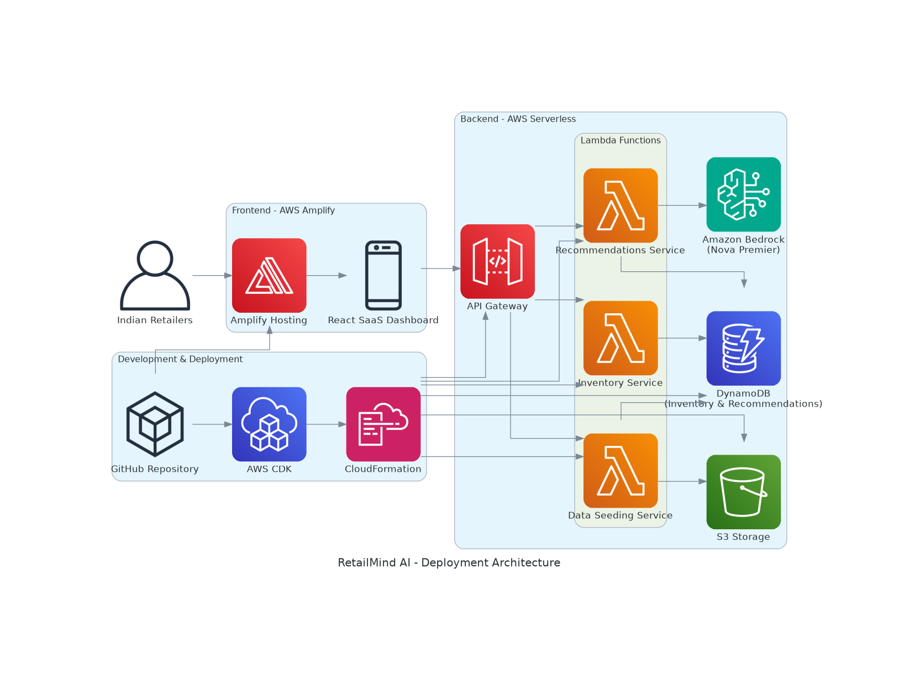
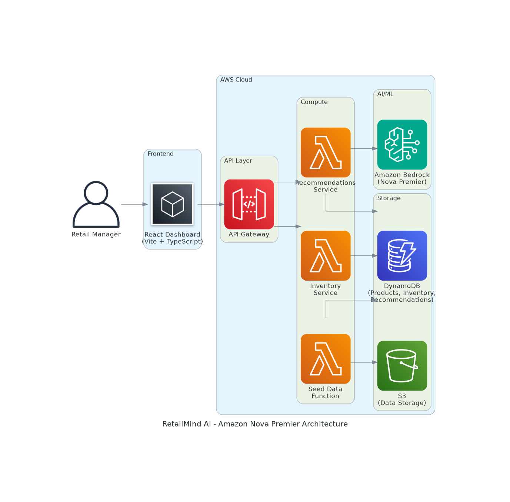

# RetailMind AI - Intelligent Retail Decision Engine

> **Built for AI for Bharat** 🇮🇳  
> Empowering Indian retailers with AI-powered inventory intelligence


An AWS-powered intelligent retail decision engine that leverages Amazon Bedrock for AI-powered inventory recommendations and automated business actions. Built with serverless architecture using AWS CDK, Lambda, DynamoDB, and React, specifically designed for the Indian retail market.

## 🇮🇳 AI for Bharat Initiative

This project is built as part of the **AI for Bharat** initiative, demonstrating how generative AI can transform retail operations in India. RetailMind AI showcases:

- **Localized for India**: All pricing in Indian Rupees (₹)
- **AWS Generative AI**: Powered by Amazon Bedrock Nova Premier
- **Serverless Architecture**: Cost-effective and scalable for Indian businesses
- **Easy Data Import**: Support for CSV/JSON files common in Indian retail
- **Accessible Technology**: Simple deployment and user-friendly interface

## 🎯 Overview

RetailMind AI helps Indian retailers make data-driven inventory decisions using artificial intelligence. The system monitors inventory levels, generates intelligent reorder recommendations, and provides actionable insights powered by Amazon Bedrock Nova Premier - all optimized for the Indian retail ecosystem.

### 🌐 Live Demo

**Try it now**: [https://main.d9i6dbk7fpk6o.amplifyapp.com/](https://main.d9i6dbk7fpk6o.amplifyapp.com/)

Experience the premium AI SaaS dashboard with:
- Real-time inventory monitoring
- AI-powered recommendations
- Interactive theme toggle (light/dark mode)
- AI chat assistant
- Glassmorphism design with smooth animations

### 🌐 Deployment Architecture



This application is deployed on AWS using:
- **Frontend**: AWS Amplify (Continuous deployment from GitHub)
- **Backend**: AWS CDK (Lambda, DynamoDB, API Gateway, Bedrock)
- **CI/CD**: Automatic deployments on every push to main branch
- **SSL**: Automatic HTTPS with AWS-managed certificates

## ✨ Key Features

### AI for Bharat Highlights

- 🇮🇳 **Built for India** - INR currency, localized for Indian retail market
- 🤖 **Generative AI** - Amazon Bedrock Nova Premier for intelligent insights
- 💡 **Accessible AI** - Easy-to-use interface for all business sizes
- 💰 **Cost-Effective** - Serverless architecture keeps costs low (~₹400-800/month)

### Premium AI SaaS Dashboard

- 🎨 **Glassmorphism Design** - Modern frosted glass aesthetics with backdrop blur effects
- 🌈 **Dynamic Gradients** - Purple-blue-pink color schemes with smooth transitions
- ✨ **Smooth Animations** - 60 FPS Framer Motion animations throughout the interface
- 🌓 **Theme Toggle** - Seamless light/dark mode with localStorage persistence
- 💬 **AI Chat Assistant** - Floating AI support with real-time inventory insights
- 📱 **Fully Responsive** - Optimized for mobile, tablet, and desktop devices

### Core Features

- 📊 **Real-time Dashboard** - Interactive KPIs and analytics with beautiful UI
- 📁 **Flexible Data Import** - Upload CSV/JSON files or use sample data
- ✅ **Accept/Dismiss Actions** - Take action on recommendations with one click
- 📈 **AI Trend Analysis** - Demand forecasts, inventory risk, and sales patterns
- 🎯 **Smart Insights** - AI-powered stock alerts and reorder recommendations
- ☁️ **Serverless Architecture** - Fully managed AWS infrastructure

## 📁 Project Structure

```
RetailMind-AI/
├── backend/                    # AWS CDK Infrastructure
│   ├── stacks/                # CDK stack definitions
│   ├── lambda/                # Lambda function code
│   │   ├── inventory/        # Inventory management
│   │   ├── recommendations/  # AI recommendations
│   │   └── data/             # Data seeding
│   ├── app.py                # CDK app entry point
│   └── requirements.txt      # Python dependencies
├── frontend/                  # React Frontend
│   ├── src/
│   │   ├── components/       # Reusable components
│   │   │   ├── Layout.tsx              # Main layout with navigation
│   │   │   ├── GlassCard.tsx           # Glassmorphism card component
│   │   │   ├── BackgroundEffects.tsx   # Animated background
│   │   │   ├── FloatingAIAssistant.tsx # AI chat widget
│   │   │   ├── DataUploadModal.tsx     # Data seeding modal
│   │   │   ├── HeroSection.tsx         # Dashboard hero
│   │   │   ├── KPIMetricsGrid.tsx      # Dashboard metrics
│   │   │   ├── AIInsightsPanel.tsx     # AI insights
│   │   │   ├── RetailFeaturesGrid.tsx  # Feature cards
│   │   │   ├── RecommendationHeroBanner.tsx
│   │   │   ├── RecommendationFeed.tsx
│   │   │   ├── AITrendAnalysisPanel.tsx
│   │   │   ├── InventoryHeroSection.tsx
│   │   │   ├── InventoryMetricsCards.tsx
│   │   │   ├── InventoryTable.tsx
│   │   │   └── AIStockInsightsPanel.tsx
│   │   ├── pages/            # Page components
│   │   │   ├── Dashboard.tsx           # Main dashboard
│   │   │   ├── Inventory.tsx           # Inventory listing
│   │   │   └── Recommendations.tsx     # AI recommendations
│   │   ├── contexts/         # React contexts
│   │   │   └── ThemeContext.tsx        # Theme provider
│   │   ├── config/           # Configuration
│   │   │   └── theme.ts                # Theme colors & effects
│   │   ├── App.tsx           # Root component with routing
│   │   └── main.tsx          # Entry point
│   └── package.json          # Node dependencies
├── docs/                      # 📚 Documentation
│   ├── deployment/           # Deployment guides
│   ├── features/             # Feature documentation
│   ├── templates/            # Template guides
│   └── README.md             # Documentation index
├── templates/                 # Data templates
│   ├── sample-data-template.csv
│   └── sample-data-template.json
├── generated-diagrams/        # Architecture diagrams
└── README.md                  # This file
```

## 🚀 Quick Start

### Prerequisites

- Python 3.12+
- Node.js 18+
- AWS Account with Bedrock access
- AWS CLI configured
- GitHub account (for AWS Amplify deployment)

### Deployment Options

**Option 1: AWS Amplify (Recommended for Frontend)**
- Automatic CI/CD from GitHub
- Built-in CDN and SSL
- Zero-downtime deployments
- See [Amplify Deployment Guide](docs/deployment/AMPLIFY_DEPLOYMENT.md)

**Option 2: Local Development**
- Run frontend locally with `npm run dev`
- Connect to deployed backend API
- See instructions below

### 1. Backend Deployment

```bash
cd backend

# Create virtual environment
python -m venv venv
source venv/bin/activate  # Windows: venv\Scripts\activate

# Install dependencies
pip install -r requirements.txt

# Bootstrap CDK (first time only)
cdk bootstrap

# Deploy infrastructure
cdk deploy
```

**Save the API Gateway URL from the output!**

### 2. Frontend Deployment (AWS Amplify)

**Quick Setup (5 minutes):**

1. **Push code to GitHub** (if not already done)
   ```bash
   git add .
   git commit -m "Initial commit"
   git push origin main
   ```

2. **Set up AWS Amplify**
   - Go to: https://console.aws.amazon.com/amplify/
   - Click "New app" → "Host web app"
   - Connect GitHub repository: `RetailMind-AI`
   - Select branch: `main`
   - Amplify auto-detects `amplify.yml` ✅

3. **Add Environment Variable**
   - In Amplify Console, click "Advanced settings"
   - Add environment variable:
     - Key: `VITE_API_URL`
     - Value: `https://YOUR-API-ID.execute-api.us-east-2.amazonaws.com/prod`
   - Click "Save and deploy"

4. **Wait for deployment** (3-5 minutes)
   - Your app will be live at: `https://main.YOUR-APP-ID.amplifyapp.com`

**For detailed instructions, see [Amplify Deployment Guide](docs/deployment/AMPLIFY_DEPLOYMENT.md)**

### 2. Frontend Setup (Local Development)

```bash
cd frontend

# Install dependencies (includes Framer Motion)
npm install

# Create .env file with your API URL
echo "VITE_API_URL=https://YOUR-API-ID.execute-api.us-east-2.amazonaws.com/prod" > .env

# Start development server
npm run dev
```

Visit `http://localhost:3000` to see the premium AI SaaS dashboard!

### 3. Explore Premium Features

1. **Toggle Theme**: Click the sun/moon icon in the navigation bar
2. **AI Chat**: Click the floating AI assistant in the bottom-right corner
3. **View Animations**: Navigate between pages to see smooth transitions
4. **Responsive Design**: Resize your browser to see adaptive layouts

### 3. Load Sample Data

1. Click the "Seed Data" button in the dashboard
2. Choose "Sample Data" or "Upload File"
3. Click "Load Sample Data" or upload your CSV/JSON file

### 4. Generate AI Recommendations

1. Navigate to the Recommendations page
2. Click "Generate New Recommendations"
3. Review AI-powered insights
4. Accept or Dismiss recommendations

## 📚 Documentation

Comprehensive documentation is available in the [docs/](docs/) folder:

### 🚀 Deployment

- [Backend Deployment Guide](docs/deployment/DEPLOYMENT.md) - AWS CDK backend deployment
- [Frontend Deployment Guide](docs/deployment/AMPLIFY_DEPLOYMENT.md) - AWS Amplify frontend deployment
- [Cleanup Guide](docs/deployment/CLEANUP.md) - Resource cleanup and cost management
- [Bedrock Model Update](docs/deployment/BEDROCK_MODEL_UPDATE.md) - Model configuration

### ✨ Features
- [Frontend Enhancements](docs/features/FRONTEND_ENHANCEMENTS.md) - UI/UX improvements
- [Data Seeding](docs/features/DATA_SEEDING.md) - Data import feature
- [INR & File Upload](docs/features/INR_AND_FILE_UPLOAD_UPDATE.md) - Currency and upload features
- [Recommendations](docs/features/RECOMMENDATIONS_INR_AND_ACTIONS.md) - AI recommendations with actions

### 📋 Templates
- [Template Guide](docs/templates/TEMPLATE_FILES_README.md) - CSV/JSON template usage
- [Sample CSV](templates/sample-data-template.csv) - Example CSV file
- [Sample JSON](templates/sample-data-template.json) - Example JSON file

## 🏗️ Architecture



### Technology Stack

**Backend:**
- AWS CDK (Infrastructure as Code)
- AWS Lambda (Python 3.12)
- Amazon DynamoDB (NoSQL Database)
- Amazon API Gateway (REST API)
- Amazon Bedrock (AI/ML - Nova Premier)
- Amazon S3 (Storage)

**Frontend:**
- React 18 + TypeScript
- Vite (Build Tool)
- Tailwind CSS (Styling)
- Framer Motion (Animations)
- React Query (Data Fetching)
- Axios (HTTP Client)
- Recharts (Data Visualization)
- Lucide React (Icons)

## 🎨 Premium UI Features

RetailMind AI features a completely redesigned premium AI SaaS dashboard with modern aesthetics and smooth user experience:

### Glassmorphism Design
- Frosted glass effect with backdrop blur on all cards and panels
- Semi-transparent backgrounds with subtle borders
- Layered depth with shadows and highlights
- Smooth hover animations with lift effects

### Dynamic Theme System
- **Light Mode**: Clean white backgrounds with vibrant gradients
- **Dark Mode**: Deep dark backgrounds with neon accents
- **Instant Toggle**: Seamless theme switching with 300ms transitions
- **Persistent**: Theme preference saved to localStorage

### Smooth Animations
- **60 FPS Performance**: GPU-accelerated CSS transforms
- **Framer Motion**: Professional entrance and exit animations
- **Staggered Effects**: Cards and elements animate in sequence
- **Reduced Motion**: Respects accessibility preferences

### AI Chat Assistant
- **Floating Widget**: Always-accessible AI support in bottom-right corner
- **Real-time Insights**: Queries actual inventory and recommendations data
- **Smart Responses**: Contextual answers about restocking, trends, and forecasts
- **Quick Actions**: Pre-built prompt buttons for common queries
- **INR Support**: All financial data displayed in Indian Rupees

### Gradient Color Palette
- **Primary**: Purple to Blue gradients
- **Secondary**: Pink to Purple gradients
- **Accent**: Emerald to Teal gradients
- **Dynamic**: Smooth color transitions on hover and interaction

### Responsive Design
- **Mobile First**: Optimized touch targets and stacked layouts
- **Tablet Adaptive**: Responsive grids and flexible components
- **Desktop Enhanced**: Full-width layouts with side panels
- **Cross-browser**: Tested on Chrome, Firefox, Safari, Edge

## 🔌 API Endpoints

| Method | Endpoint | Description |
|--------|----------|-------------|
| GET | `/inventory` | Get all inventory items |
| GET | `/recommendations` | Get pending recommendations |
| POST | `/recommendations` | Generate new AI recommendations |
| PATCH | `/recommendations/{id}` | Accept/Dismiss recommendation |
| POST | `/seed` | Load sample or custom data |

## 💰 Cost Estimation (India)

**Backend (Monthly):**

- DynamoDB: ~₹80-160 (On-Demand)
- Lambda: ~₹40-80 (Free tier eligible)
- API Gateway: ~₹80-160
- Bedrock: ~₹40-160 (Pay per use)
- S3: ~₹8-40
- **Backend Total: ₹400-800/month (~$5-10/month)**

**Frontend - AWS Amplify (Monthly):**

- Build minutes: ~₹240-400 (10 builds/month)
- Hosting: ~₹0.01 (5-10 MB bundle)
- Data transfer: ~₹60 (1 GB/month)
- **Frontend Total: ₹300-500/month (~$4-6/month)**

**Total Development/Testing Cost: ₹700-1,300/month (~$9-16/month)**

**Production (Monthly):**

- Scales based on usage
- Estimated: ₹2,000-5,000/month (~$25-60/month) for small business
- Affordable for Indian SMEs and startups

**Free Tier Benefits:**

- Lambda: 1M requests/month free
- DynamoDB: 25 GB storage free
- Amplify: 1,000 build minutes/month free
- API Gateway: 1M requests/month free (first 12 months)

See [Cleanup Guide](docs/deployment/CLEANUP.md) for cost management.

## 🛠️ Development

### Backend Development

```bash
cd backend
source venv/bin/activate

# Run tests
pytest

# Check CDK diff
cdk diff

# Deploy changes
cdk deploy
```

### Frontend Development

```bash
cd frontend

# Start dev server
npm run dev

# Build for production
npm run build

# Preview production build
npm run preview
```

## 🧪 Testing

### Load Sample Data

Use the built-in data seeding feature:
1. Dashboard → "Seed Data" button
2. Select "Sample Data" tab
3. Click "Load Sample Data"

### Upload Custom Data

1. Dashboard → "Seed Data" button
2. Select "Upload File" tab
3. Upload CSV or JSON file
4. See [Template Guide](docs/templates/TEMPLATE_FILES_README.md)

## 🔧 Troubleshooting

### Amplify Build Fails

**Issue**: TypeScript compilation errors or build failures

**Solution**: The project includes fixes for common build issues:
- TypeScript `import.meta.env` type assertion
- Unused variable cleanup
- Memory optimization for large builds

If build still fails:
1. Check build logs in Amplify Console
2. Verify `VITE_API_URL` environment variable is set
3. Ensure `amplify.yml` is in root directory
4. Try redeploying: Deployments → "Redeploy this version"

### Bedrock Access Denied

1. Go to AWS Console → Bedrock
2. Request model access for Nova Premier
3. Wait for approval (usually instant)

### CDK Deploy Fails

```bash
# Verify AWS credentials
aws sts get-caller-identity

# Re-bootstrap if needed
cdk bootstrap
```

### Frontend Connection Issues

1. Check `.env` file has correct API URL
2. Verify CORS is enabled
3. Check browser console for errors
4. Verify backend is deployed and accessible

## 📈 Roadmap

- [ ] Multi-store support
- [ ] Advanced analytics dashboard
- [ ] Email notifications
- [ ] Mobile app (React Native)
- [ ] Integration with POS systems
- [ ] Predictive demand forecasting
- [ ] Automated purchase orders
- [ ] Multi-currency support

## 🤝 Contributing

Contributions are welcome! Please:
1. Fork the repository
```
https://github.com/dineshrajdhanapathyDD/RetailMind-AI.git
```
2. Create a feature branch
3. Make your changes
4. Submit a pull request

## 📄 License

MIT License - See LICENSE file for details

## 🇮🇳 AI for Bharat

This project demonstrates the power of AWS Generative AI services for Indian businesses:

### Why AI is Required
- **Inventory Optimization**: Reduce stockouts and overstock situations
- **Data-Driven Decisions**: Move from gut feeling to AI-powered insights
- **Cost Savings**: Optimize inventory levels and reduce waste
- **Competitive Edge**: Small retailers can compete with large chains

### AWS Services Used
- **Amazon Bedrock**: Foundation model (Nova Premier) for generating intelligent recommendations
- **AWS Lambda**: Serverless compute for business logic
- **Amazon DynamoDB**: Scalable NoSQL database
- **Amazon API Gateway**: RESTful API endpoints
- **AWS CDK**: Infrastructure as Code for easy deployment

### Value Added by AI
- **Intelligent Insights**: AI analyzes inventory patterns and generates actionable recommendations
- **Natural Language**: Easy-to-understand recommendations in plain language
- **Confidence Scoring**: AI provides confidence levels for each recommendation
- **Priority Classification**: Automatic prioritization (Critical/High/Medium/Low)
- **Business Impact**: AI explains the business impact of each recommendation

### Built for Indian Retail
- **INR Currency**: All pricing in Indian Rupees
- **Scalable**: Works for small shops to large chains
- **Affordable**: Serverless architecture keeps costs low
- **Easy to Use**: Simple interface for non-technical users
- **Flexible Data**: Import from Excel, CSV, or JSON files

## 🙏 Acknowledgments

- **AWS India** for Generative AI services and support
- **AI for Bharat** initiative for inspiring this project
- Amazon Bedrock for AI capabilities
- AWS CDK for infrastructure management
- React and Tailwind CSS communities

---

**Built with ❤️ for Indian Retailers using AWS Generative AI**

*Part of the AI for Bharat initiative - Empowering India with AI*

For detailed documentation, visit the [docs/](docs/) folder.
